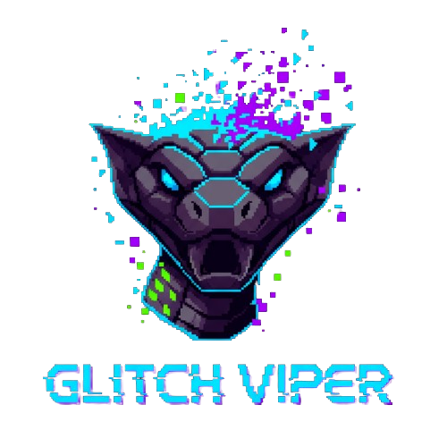

# GLITCH VIPER 🐍

**Glitch Viper**, klasik yılan oyununun modern, kaotik ve özelliklerle dolu bir versiyonudur. Farklı oyun modları, "glitch" temalı görsel efektleri ve dinamik müzikleriyle benzersiz bir deneyim sunar.



## 🎮 Özellikler

* **4 Farklı Oyun Modu:**
    * **Classic:** Saf yetenek. Ekstra özellikler yok, sadece sen ve yılan.
    * **Survival:** Zamana karşı yarış. Açlık barı bitmeden yemek ye!
    * **Mutation:** Yılanın DNA'sı bozuluyor! Rastgele parçaların kopabilir.
    * **Bomb:** Sahada patlayan bombalardan kaçın.
* **Güçlendirmeler (Power-ups):**
    * 🛡️ **Shield:** Çarpışmalardan korur.
    * 🧲 **Magnet:** Yemekleri uzaktan çeker.
    * ⚡ **2x Score:** Puanları ikiye katlar.
    * ⏱️ **Slow:** (Sadece Survival/Mutation modlarında) Zamanı yavaşlatır.
* **Kombo Sistemi:** Arka arkaya hızlı yemek yiyerek puanını katla.
* **Dinamik Zorluk:** Kolay, Normal ve Zor seviyeleri.
* **Yüksek Skorlar:** Her mod ve harita için yerel skor tablosu.

## 🛠️ Kurulum

Bu oyunu çalıştırmak için bilgisayarınızda Python yüklü olmalıdır.

1.  Bu depoyu klonlayın veya indirin:
    ```bash
    git clone https://github.com/Sitopapa/GlitchViper.git
    cd GlitchViper
    ```

2.  Gerekli kütüphaneleri yükleyin:
    ```bash
    pip install -r requirements.txt
    ```

3.  Oyunu başlatın:
    ```bash
    python main.py
    ```

## 🕹️ Kontroller

* **Yön Tuşları / W-A-S-D:** Yılanı hareket ettir.
* **R:** Oyun bittiğinde yeniden başlat (Restart).
* **ESC / M:** Menüye dön.

## 🎵 Atıflar ve Telif Hakları (Credits)

### Müzikler (Music)
Oyun içerisindeki atmosferik müzikler **Eric Matyas** tarafından bestelenmiştir.
* **Music by Eric Matyas**
* 🌐 [www.soundimage.org](https://soundimage.org)

### Ses Efektleri (SFX)
Ses efektleri **Pixabay** üzerinden temin edilmiştir.

### Grafikler (Assets)
Oyun içerisindeki piksel çizimler ve görsel tasarımlar proje sahibine aittir.

## 📄 Lisans (License)

Bu projenin kaynak kodları ve özgün varlıkları **Telif Hakkı (c) 2025 Veli GEÇGEL**'a aittir.

* Kaynak kodlarını inceleyebilir ve bireysel (ticari olmayan) amaçlarla değiştirebilirsiniz.
* Oyunun bu haliyle ticari olarak satılması veya "Soundimage.org" müziklerinin atıf yapılmadan kullanılması yasaktır.

---
*Developed with ❤️ using Python & Pygame.*
